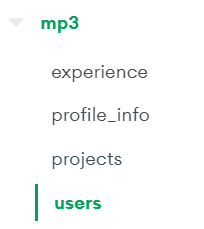
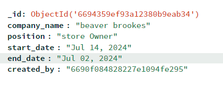
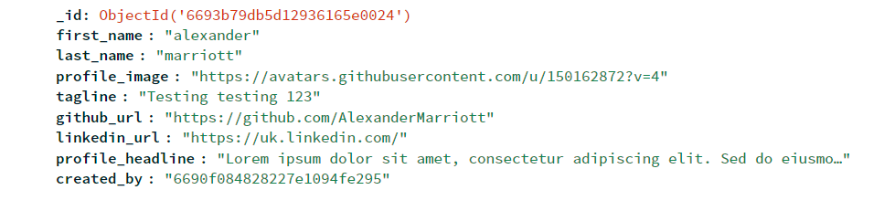
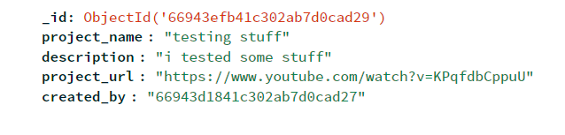
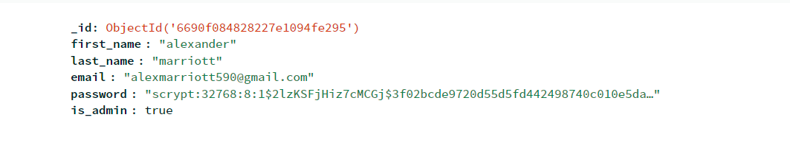
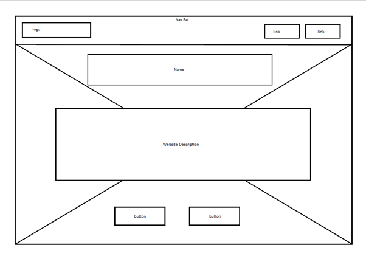
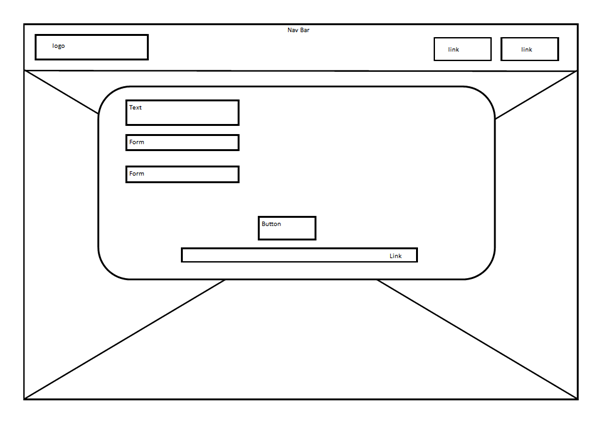
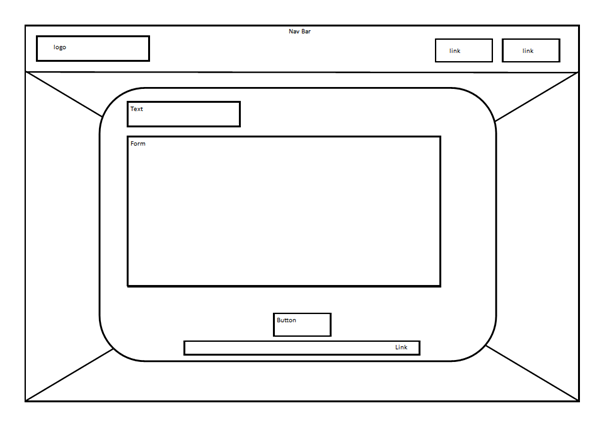
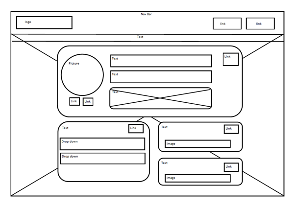
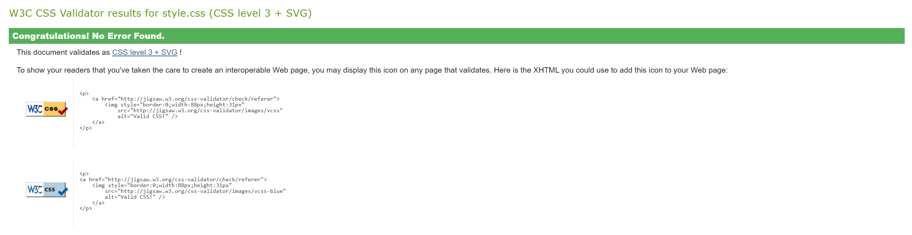

# Milestone Project 3

## Table of Contents

- [Introduction](#introduction)
- [Project Goals](#project-goals)
- [Deployment](#deployment)
- [Website Structure and Design](#website-structure-and-design)
  - [Design Choices](#design-choices)
  - [WireFrames](#wireframes)
- [Built With](#built-with)
- [Testing](#testing)
  - [Manual Testing](#manual-testing)
  - [Validation](#validation)
  - [Live Testing](#live-testing)
- [Contact](#contact)
- [Acknowledgements](#acknowledgements)

## Introduction

This website is an online platform called ‘SkillSync’ as part of the Code Institute Milestone 3 Project that enables users to create professional profiles that showcase their Projects and experience to potential employers. Enhancing job seekers’ visibility and connecting them with potential employment opportunities is the key purpose of SkillSync.

## Project Goals

The primary objectives of this project have been to:

- Provide a user-friendly interface for creating and managing professional profiles to enable users to list their experience and Projects in an easy-to-read manner
- Ensure data privacy and security for all user information
- Facilitate connections between job seekers and employers, all whilst fulfilling the criteria of the Code Institute Milestone 3 Project.

## Deployment

Following the steps below will allow for deployment of SkillSync:

### Setup Development Environment

1. Clone the repo: `git clone https://github.com/AlexanderMarriott/milestone-3.git`
2. Navigate to the project directory: `cd milestone-3`
3. Install the required dependencies: `pip install -r requirements.txt`

### Deployment to Heroku

1. Create a new Heroku app: `heroku create`
2. Add MongoDB as the database: Use an add-on like mLab or MongoDB Atlas.
3. Deploy the app: `git push heroku main`
4. Configure environment variables: Set up the MongoDB URI and any other necessary environment variable in Heroku
5. Access the live site at the Heroku URL provided.

When I deployed this site to Heroku I:

- Created a `requirements.txt` file using pip freeze
- Created a `Procfile`
- Linked my GitHub to Heroku
- Created a new app
- Transferred my Secrets from the `app.py` file over to the Heroku Configuration Variables
- Selected the milestone-3 repository from my GitHub
- Disabled debugging
- Launched from main

## Website Structure and Design

### Design Choices

I first decided what key design principles I wanted SkillSync to follow. Considering the platform is to showcase professional profiles I wanted the visual design of SkillSync to utilize a clean and professional aesthetic with a consistent colour scheme and typography. I felt this visual design reflects and complements the purpose of the platform.

To ensure all the features of the platform are accessible to users with disabilities I set all values where required for screen readers using contrasting colours to ensure clear definitions between back and foreground elements.

I designed the site to be clear and logical in its structure to help users find information quickly and easily. Throughout the design process, navigation and ease of use were prioritised. I wanted to ensure a user-friendly platform leaving people with an exceptional user experience.

### Schema

The database used is MongoDB and consists of the following collections inside of the `mp3` (milestoneproject3) database:

- Experience:
  
  - The `created_by` attribute is used when populating data to users' profiles.
- Profile_info:
  
- Projects:
  
- Users:
  

### WireFrames

The proposed layout provided a basic layout of the homepage profile creation page and user dashboard. Revisions were then made based on user feedback and testing including improved navigation and additional profile customisation options. Please see the proposed layout below:

#### HomePage:

#### Sign in Page:

#### Sign Up Page:

#### Profile Page:

## Built With

SkillSync was built using the following technologies:

- **Frontend**: HTML, CSS, JQuery, Materialize
- **Backend**: Python and Flask
- **Database**: MongoDB
- **Deployment**: Heroku

## Testing

### Manual Testing

Manual testing included:

- A functional test to ensure all features were working as intended.
- A usability test verifying ease of use for end-users.
- A responsiveness test to check compatibility across different devices and screen sizes.

### Validation

Validation includes:

- **HTML**: Unable to find a validator that understands Flask.
- **CSS**: Validated with W3C Validator.
  
- **JQUERY**: Unable to find a JQuery validator.

### Live Testing

Live testing involves:

- Deploying the app on Heroku
- Gathering user feedback and addressing any reported issues
- Continuous monitoring for bugs and performance

Initial testing was done via dev tools, testing different devices and screen widths. All tests returned working as intended.

#### Bugs

- **Broken Link**: If a user enters a broken link in their portfolio, it returns an error when clicked. This can be fixed by adding checks to links upon form submit and providing feedback to update or remove the broken link. Additionally, checking the validity of the links on click can show a notification if invalid and redirect to the profile page.
- **Sign in/Sign up Modals**: Once opened, users can swap between the two but can't close them without refreshing the page. Adding a close (X) in the top right corner will fix this.

#### Google Lighthouse Results

### Security

Password information is hashed and stored in the database using werkzeug.security.

This helps to ensure only the user can access and perform CRUD operations on their profiles. When a user visits a profile, a check is performed to see if the profile belongs to the user using the `ObjectId` for the user that’s signed in. If there’s no match, the user will only be able to view the information on that page and not have access to any CRUD functionality.

A check to see if a user is an admin is performed on sign-in. This is set to false by default on sign-up and can only be changed by accessing the database which is protected using MFA and Authentication services.

### Database Configuration

Database configuration for the live app is stored inside Heroku’s configuration variables. During development, they were stored and accessed from inside an `app.py` file. The database itself is managed inside MongoDB Atlas.

## Contact

Reach out to me (Alexander Marriott) at [alexmarriott590@gmail.com](mailto:alexmarriott590@gmail.com) for any enquiries. Please utilise the subject matter with a brief description of the nature of your inquiry.

## Acknowledgements

The following acknowledgements are made to all contributors to SkillSync, libraries and frameworks used, and any other third-party resources:

- [Materialize](https://materializecss.com) for elements
- [MongoDB Atlas](https://cloud.mongodb.com) for viewing the database
- [FontAwesome](https://fontawesome.com/) for icons
- [Heroku](https://www.heroku.com/) for project deployment

## Live Video of Website Functionality (no audio)

[Watch Video](https://youtu.be/xzAI5iHRbiA?si=UMrLhL_5Mx0YvjQD)
